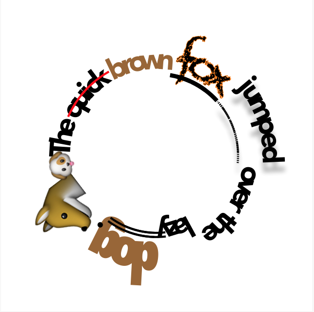

# CircularTextView
`UIView` subclass that displays an `NSAttributedString` in a circle based on the bounds and inset of the view. Swift version of [this](https://gist.github.com/warpling/fae69d61986c6b7b38f33b83d65de0ed).

Some improvements include handling of emoji, multiple font families and sizes as well as many `NSAttributedString` attributes. 

Should work on swift 3.0 Xcode beta 6.

##Example

```
let circularTextView = CircularTextView(frame: CGRect(x: 0.0, y: 0.0, width: 320.0, height: 320.0))
circularTextView.inset = -15.0
circularTextView.backgroundColor = UIColor.white
let font = UIFont(name: "Avenir-Black", size: 30.0)!
let attribString = NSMutableAttributedString(string: "The quick brown fox jumped over the lazy dog. 🐺  🐶", attributes: [NSFontAttributeName: font, NSForegroundColorAttributeName: UIColor.darkText, NSKernAttributeName: 1.25])

//Then style your NSAttributedString as you like... 

circularTextView.attributedText = attribString

```

Which results in:



##Todos
- Clean up code
- Improve underline and strike through particularly dotted underline
- Support more attributes
